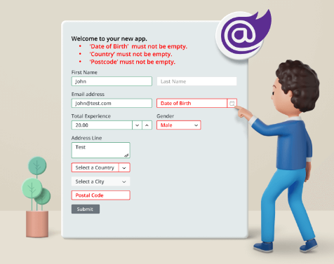

# Form Validation Project  &nbsp; 

> This is a simple project that demonstrates form validation using JavaScript, HTML, and Bootstrap.
The goal of this project is to validate user input in a form and provide feedback to the user in real-time.

## Technologies Used

- JavaScript
- HTML
- Bootstrap
## Getting Started

To get started with the project, follow the instructions below:
- Clone the repository or download the project files.
- Open the project directory.
- Open the index.html file in a web browser.
## Project Structure
The project consists of the following files:
- index.html: This is the main HTML file that contains the form and its elements.
- script.js: This file contains the JavaScript code for form validation.
## Form Validation
The form validation is implemented using JavaScript. The following validations are performed on the form fields:
- Name: The name field must not be empty and should contain only alphabetic characters.
- Email: The email field must not be empty and should be a valid email address.
- Password: The password field must not be empty and should be at least 8 characters long.
- Confirm Password: The confirm password field must match the password field.
- Contact Number: This field allows users to enter their contact number. It is validated to ensure it contains only numeric characters.
- Gender: This field allows users to select their gender from a dropdown menu. It is validated to ensure that a gender option is selected.

If any of the fields fail validation, an error message is displayed next to the respective field. If all fields pass validation, a success message is displayed.
## Styling with Bootstrap
Bootstrap is used for styling the form and displaying validation messages. The Bootstrap classes are applied to the form elements and error/success messages to improve the visual appearance of the form.
## Contributing
Contributions are welcome! If you find any issues or would like to enhance the project, feel free to submit a pull request.
## License

This project is licensed under the [MIT](https://choosealicense.com/licenses/mit/) License. Feel free to use and modify the code as per your needs.
## Acknowledgements

This project was created as a learning exercise and was inspired by various form validation tutorials and examples available online.
